# Auto Sparkle

A Flutter app for a mobile car wash business. Customers book a wash at home or at the shop, track appointments and wash history, review completed washes, and shop for car accessories.

> **Status: UI prototype.** Every screen runs on built-in demo data and there is no backend yet. Features that need one (payments, sign-in, search, saved addresses, voice notes) show a "coming soon" message.

<p align="center">
  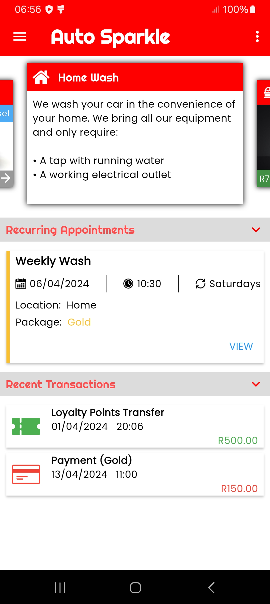
  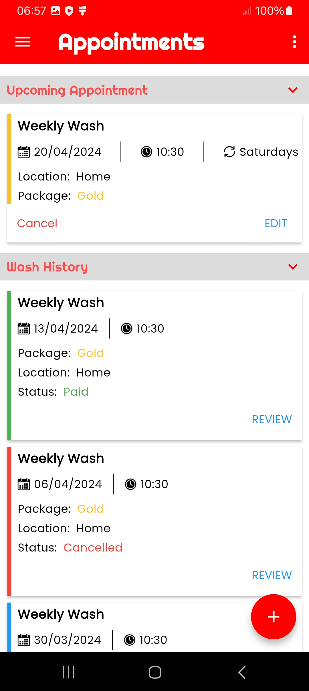
  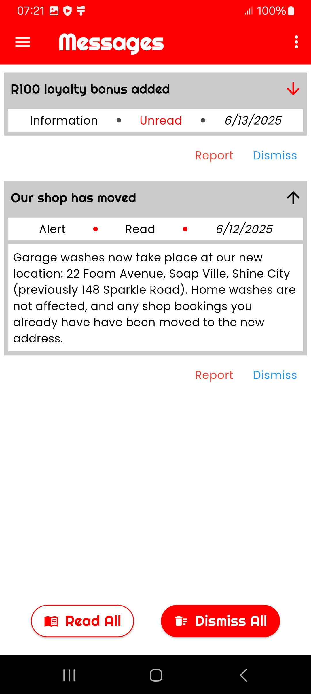
  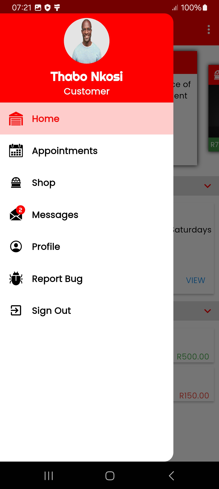
</p>

## Features

| Area | What works today |
| --- | --- |
| **Home** | Carousel of featured products and services, recurring appointments, recent wallet transactions |
| **Appointments** | Upcoming appointment (cancel with confirmation, edit), wash history with Paid / Cancelled / Pending status |
| **Booking** | Four-step wizard: package (Bronze, Silver, Gold, VIP), address (garage or home), date and time slot, confirm |
| **Reviews** | Rate a past wash out of five and leave a comment |
| **Shop** | Product cards with colour options, favourites and add-to-cart |
| **Messages** | On-device inbox with read, report and dismiss. Starts with two sample messages (shop move, loyalty bonus); cancelled bookings, reviews and bug reports also post here |
| **Profile** | Customer summary with shortcuts to appointments and messages |
| **Report Bug** | Available from the side menu. Reports are written to the app log |

## Screenshots

### Home and shop

| Home | Featured products | Services | Shop |
| :---: | :---: | :---: | :---: |
|  | 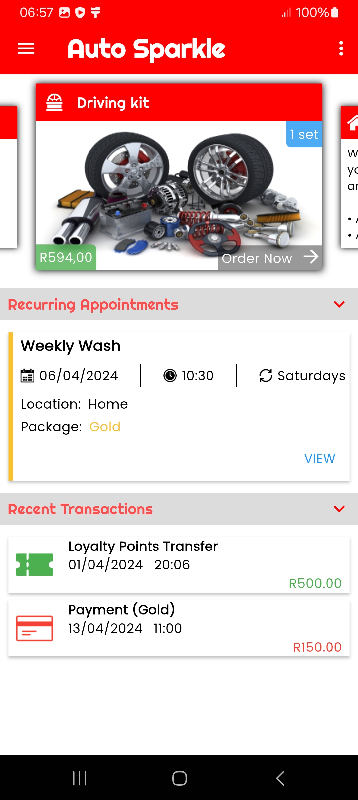 | 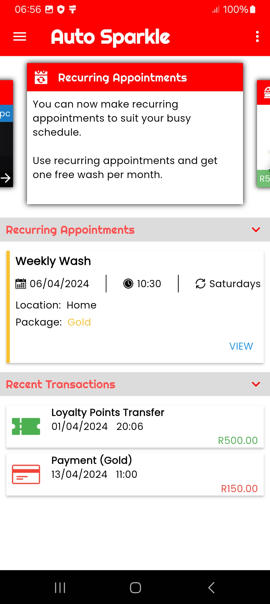 | 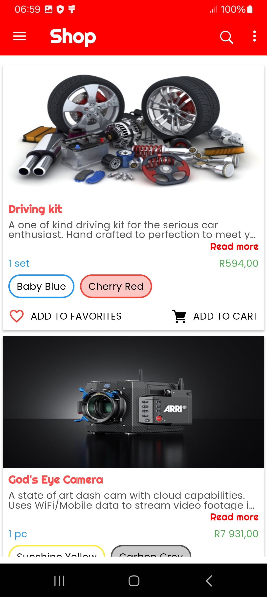 |

### Booking a wash

| Package | Choose a package | Address: garage | Address: home |
| :---: | :---: | :---: | :---: |
| 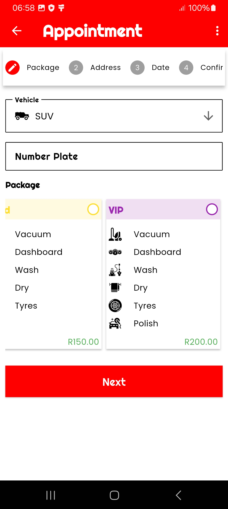 | 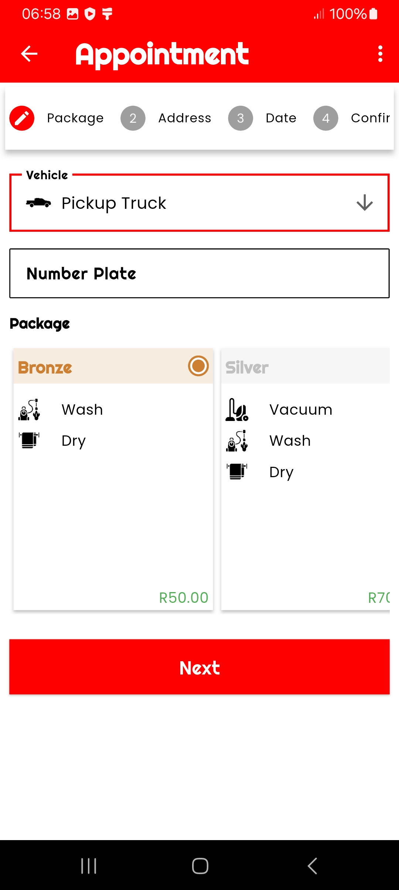 | 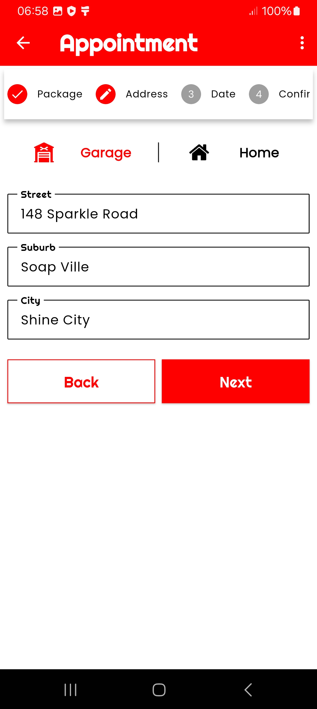 | 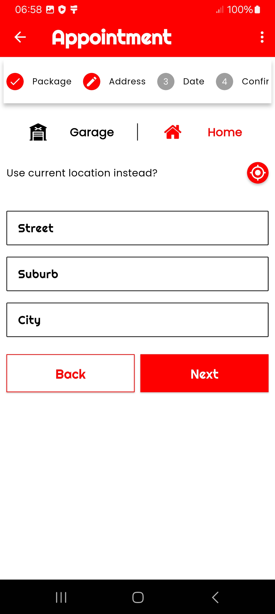 |

| Date and time | Confirm | Appointments | |
| :---: | :---: | :---: | :---: |
| 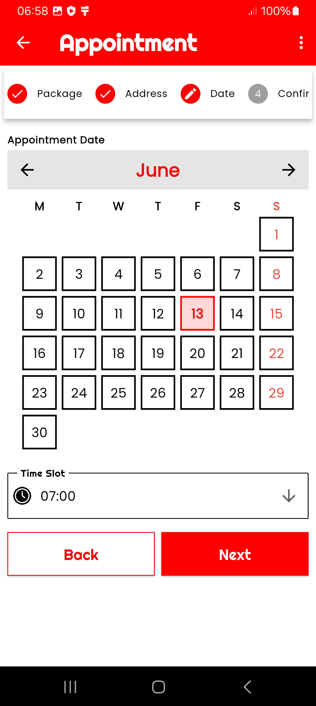 | 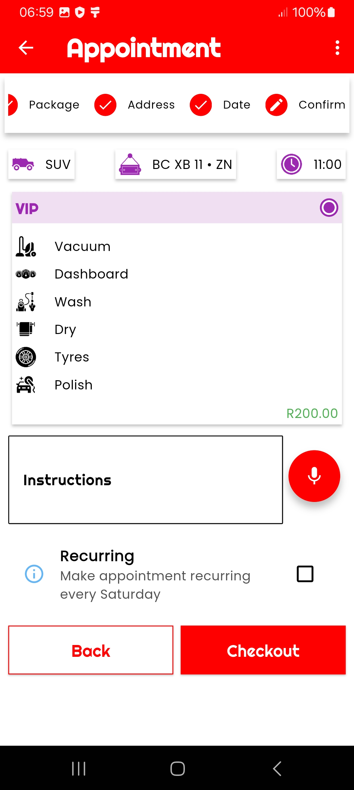 |  | |

### Messages and profile

| Messages | Navigation | Profile | |
| :---: | :---: | :---: | :---: |
|  |  | 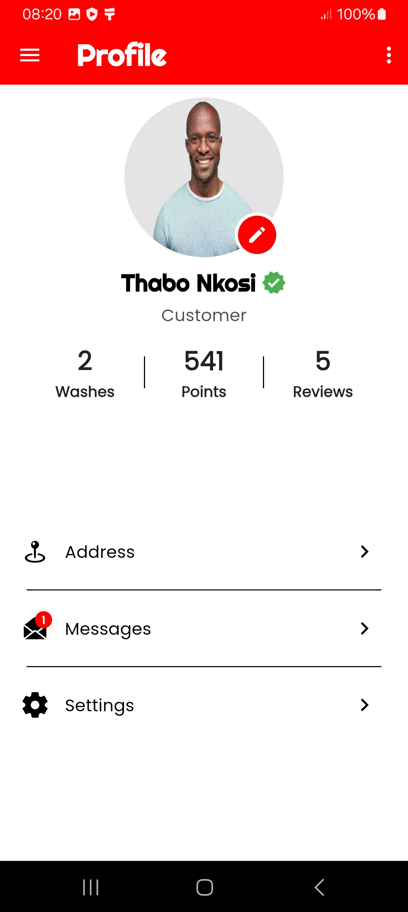 | |

## Tech stack

- Flutter 3.35 or newer (developed against Flutter 3.44 / Dart 3.12), Material 3
- [`provider`](https://pub.dev/packages/provider) for app-wide state (the message inbox)
- [`shared_preferences`](https://pub.dev/packages/shared_preferences) and [`path_provider`](https://pub.dev/packages/path_provider) for on-device storage
- [`intl`](https://pub.dev/packages/intl) for dates and currency, [`carousel_slider`](https://pub.dev/packages/carousel_slider) for the home carousel
- Fonts: [Righteous](https://fonts.google.com/specimen/Righteous) (headings) and [Poppins](https://fonts.google.com/specimen/Poppins) (body), both under the SIL Open Font License

## Getting started

Requires Flutter 3.35 or newer. Android builds use Gradle 8.14, Android Gradle Plugin 8.11 and Kotlin 2.2, and need JDK 17 or newer (the JDK bundled with Android Studio works).

```bash
cd auto_sparkle
flutter pub get
flutter run
```

Build release APKs, one per CPU architecture:

```bash
flutter build apk --release --split-per-abi
```

The APKs are written to `build/app/outputs/flutter-apk/`. Release builds are signed with the debug key for now.

Run the checks with:

```bash
flutter analyze
flutter test
```

The launcher icons and splash screen are generated from `launcher_icons.yaml` and `splash.yaml`:

```bash
dart run flutter_launcher_icons -f launcher_icons.yaml
dart run flutter_native_splash:create --path=splash.yaml
```

### Troubleshooting

- **`Type 'UnmodifiableUint8ListView' not found` in `win32`:** an old locked dependency. Run `flutter pub upgrade`, then `flutter clean`, and build again.
- **The inbox shows no sample messages:** they are only added on a fresh install. Clear the app's data or reinstall.

## Project structure

```
auto_sparkle/lib/
├── main.dart                  # App entry: theme, routes, providers
├── home-component/            # Home page, carousel, transactions
├── appointments-component/    # Appointments page and booking wizard
├── rating-component/          # Wash review screen
├── shop-component/            # Shop page and product cards
├── message-component/         # Inbox page, message widgets, MessageService
├── user-component/            # Profile page
└── common/                    # Shared navigation, theme, logger, storage, widgets
Design/Fonts/                  # Source font files and licences
Screens/                       # Screenshots used in this README
```

Each feature folder follows the same layout: a page at the top level, with `models/`, `enums/` and `widgets/` beneath it. The demo customer's name and photo are set in `DemoUser` in `common/constants.dart`.

### Navigation

Pages are opened with `PageNavigator.navigateTo<T>()`. Any screen whose class name contains `Page` is pushed as a restorable route and **must be registered** in `common/navigator/page_route_helper.dart`. Other screens, such as the booking wizard and the review screen, are pushed directly.

## Roadmap

- Backend API for bookings, payments and the shop
- Carry booking wizard selections through to the Confirm step and create real appointments
- Sign-in and customer profiles
- Cart and checkout
- Search in the shop
- Release signing and a unique Android application ID
